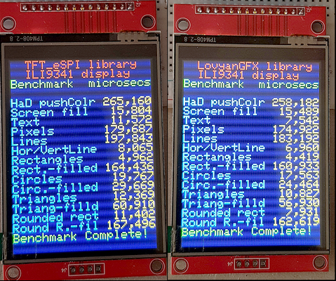
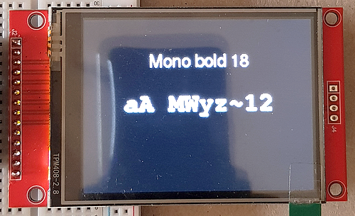
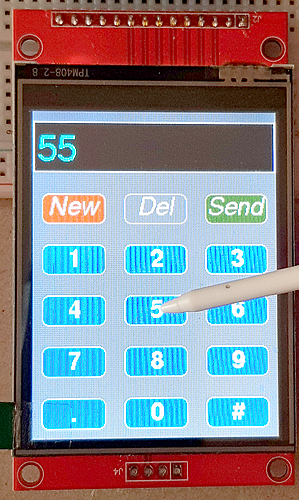
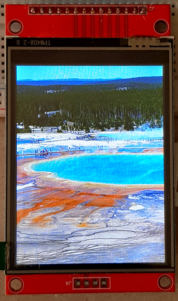
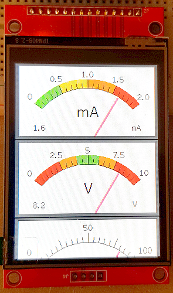
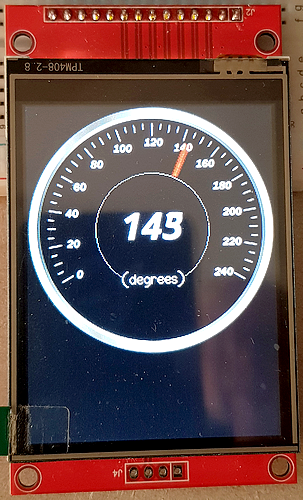

# ESP32 Tft_eSPI library to LovyanGFX library transition
The [TFT_eSPI](https://github.com/Bodmer/TFT_eSPI) is the de-facto-standard when using TFT displays connected to a microcontroller of the ESP32 family. Unfortunately this library looks like abandoned as errors were not fixed by the author since many months. It might be a good idea to transist your project to LovyanGFX library.

This is the accompanying repository for my article "**How to use the LovyanGFX library instead of the TFT_eSPI library in your ESP32 project**" available here:

## Runtime Environment
````plaintext
Arduino 2.3.6 (Windows)
esp32 boards version 3.2.0
For compiling and uploading, I'm using the "ESP32-C3 Dev Module" board
````

## Wiring of the 2.8-inches TFT Display with ILI9341 driver and resistive touch surface with XPT2046 controller
````plaintext
Display Pins  ESP32 Pins
01 VCC 3.3V   3.3 Volt
02 GND        GND
03 CS         15
04 RESET       4
05 DC          2
06 SDA (MOSI) 23
07 SCK        18
08 LED        13 (can be connected to 3.3 Volt)
09 MISO        9
--== Resistive Touch ==--
10 T_CLK      18 *1)
11 T_CS        5
12 T_DIN      23 *1)
13 T_DO        9 *1)
14 T_IRQ      not connected

*1) shared with display's pins
````

## Sketches in the example folders
There are 6 example sketches available in the folders. In each "Example x" folder, you will find 2 subfolders: one with the "original" sketch written for the TFT_eSPI library and the second folder contains the sketch that is operating with the LovyanGFX library.

### Example 1 Benchmark: 
uses the basic drawing elements like "drawString", "drawLine" or "drawCircle". In the end, a benchmark is displayed.


### Example 2 Fonts: 
TFT_eSPI comes with easy access to the "Adafruit_GFX library" and all fonts are printed on the display


### Example 3 Keypad with Touch:
There are two elements shown in the example: it displays several ('keypad') buttons (drawn by a dedicated class within the library) and the touch controller is active to react on a button push. A basic display touch calibration is shown as well


### Example 4 Images from LittleFS: 
the example reads PNG encoded images from the LittleFS file system and shows them in a loop


### Example 5 Analog Meters Widget: 
there is a supplementary library available for TFT_eSPI that adds some widgets to the library named "TFT_eWidget" and I'm showing how to use it with LovyanGFX


### Example 6 Animated Dial:
this was the most sophisticated task to convert the code that it can run the example.




